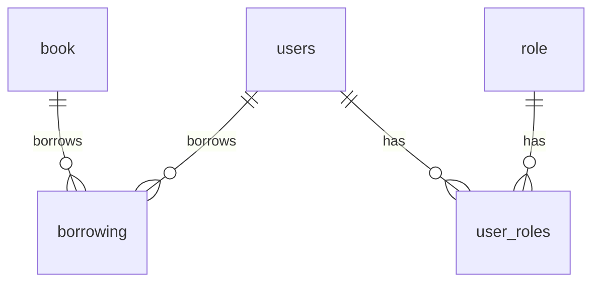

# 📚 Library Management Application API

## ✨ Overview

This application provides a comprehensive set of RESTful API endpoints to manage a library system. It offers functionalities for user management, book catalog management, borrowing and returning books, and secure access control with different user roles (patron and librarian).

## 🛠️ Tech Stack

This project is built using the following technologies:

* **☕ Java:** 21
* **🚀 Spring Boot:** 3.4.5
* **💾 Spring Data JPA:** For database interactions.
* **🐳 Docker:** For containerization and environment management.
* **🐘 PostgreSQL:** The primary relational database.
* **🧪 H2 Database:** In-memory database for development and testing.
* **🛡️ Spring Security:** For application security and authorization.
* **🕸️ Spring WebFlux:** For building reactive web applications (optional usage).
* **💧 Liquibase:** For managing database schema changes and migrations.
* **💡 Lombok:** To reduce boilerplate code.
* **🗺️ MapStruct:** For efficient object mapping.
* **🔑 JWT (io.jsonwebtoken:jjwt):** For secure authentication and authorization.
* **📝 SpringDoc OpenAPI:** For automatic API documentation (Swagger UI).

## API Collection

[View and Run the Postman Collection](https://elements.getpostman.com/redirect?entityId=33508046-bebcf996-16ce-43a3-af3a-f65f4a8e4ede&entityType=collection)


## 🚀 Getting Started

### Prerequisites

Make sure you have the following installed on your system:

* **JDK:** Version 21 or higher.
* **Maven:** For building and managing the project dependencies.

### Running the Application

#### 🔧 Option 1: Manual Run with Maven

1.  **Clone the Repository:**
    ```bash
    git clone https://github.com/emredurrmus/patikadev-finalcase.git
    cd librarymanagement
    ```

2.  **Configure Database:**
    * For **PostgreSQL**, update the database connection details in `src/main/resources/application.properties` or `application.yml`.
    * **H2** requires no additional configuration for development.

3.  **Build the Application:**
    ```bash
    mvn clean install
    ```

4.  **Run the Application:**
    ```bash
    mvn spring-boot:run
    ```
    Alternatively, you can run the packaged JAR file from the `target` directory:
    ```bash
    java -jar target/librarymanagement-0.0.1-SNAPSHOT.jar
    ```

#### 🐳 Option 2: Run with Docker

If you want to run the application using Docker and Docker Compose:

1.  **Build and Start Containers:**
    ```bash
    docker-compose up
    ```

2.  **Stop Containers:**
    ```bash
    docker-compose down
    ```

3.  **Access the Application:**
    * API Base URL: `http://localhost:8080`
    * Swagger UI: `http://localhost:8080/swagger-ui/index.html`

The application will be accessible at `http://localhost:8080`.

## 📜 API Documentation

The complete API documentation, including all endpoints, request/response bodies, and parameters, is available through Swagger UI:

Access Swagger UI: `http://localhost:8080/swagger-ui/index.html`

## 🔗 Main API Endpoints

Here's a summary of the main API endpoints:

### 🔑 Authentication

* **POST `/auth/login`:** Authenticate user and receive a JWT access token.
    ```json
    {
      "username": "your_username",
      "password": "your_password"
    }
    ```
* **POST `/auth/register`:** Register a new user.
    ```json
    {
      "firstname": "First Name",
      "lastname": "Last Name",
      "username": "new_username",
      "phone": "+90XXXXXXXXXX",
      "email": "email@example.com",
      "password": "new_password"
    }
    ```

### 👤 Users

* **GET `/api/users`:** Get all users (requires `Authorization: Bearer <your_token>`).
* **GET `/api/users/{id}`:** Get a specific user by ID (requires `Authorization: Bearer <your_token>`).
* **PUT `/api/users/{id}`:** Update user information (requires `Authorization: Bearer <your_token>`, `Content-Type: application/json`).
    ```json
    {
      "username": "updated_username",
      "firstName": "Updated First Name",
      "lastName": "Updated Last Name",
      "email": "updated_email@example.com",
      "password": "updated_password"
    }
    ```
* **PUT `/api/users/role/{id}`:** Update the role of a specific user (requires `Authorization: Bearer <your_token>`, `Content-Type: application/json`).
    ```json
    {
      "role": "ROLE_LIBRARIAN"
    }
    ```
* **DELETE `/api/users/{id}`:** Delete a specific user (requires `Authorization: Bearer <your_token>`).

### 📖 Books

* **POST `/api/books`:** Add a new book (requires `Authorization: Bearer <your_token>`, `Content-Type: application/json`).
    ```json
    {
      "title": "Book Title",
      "author": "Author Name",
      "isbn": "978-XXX-XX-XXXX-X",
      "publishedDate": "2023-10-26T10:00:00",
      "price": 29.99,
      "genre": "FICTION",
      "description": "Book description."
    }
    ```
* **PUT `/api/books/{id}`:** Update an existing book (requires `Authorization: Bearer <your_token>`, `Content-Type: application/json`).
    ```json
    {
      "title": "Updated Book Title",
      "author": "Updated Author Name",
      "isbn": "978-YYY-YY-YYYY-Y",
      "publishedDate": "2024-01-15T12:30:00",
      "price": 35.50,
      "genre": "SCIENCE FICTION",
      "description": "Updated book description."
    }
    ```
* **GET `/api/books/{id}`:** Get a specific book by ID (requires `Authorization: Bearer <your_token>`).
* **DELETE `/api/books/{id}`:** Delete a specific book (requires `Authorization: Bearer <your_token>`).
* **GET `/api/books`:** Get all active books (requires `Authorization: Bearer <your_token>`).
* **GET `/api/books/search?title=...&author=...&isbn=...&genre=...`:** Search books by title, author, ISBN, or genre (requires `Authorization: Bearer <your_token>`).
* **GET `/api/books/available`:** Get all active and available books (requires `Authorization: Bearer <your_token>`).

### 🔄 Borrowing

* **POST `/api/borrowings/borrow/{bookId}`:** Borrow a specific book for the authenticated user (requires `Authorization: Bearer <your_token>`).
* **POST `/api/borrowings/return/{borrowingId}`:** Return a specific borrowed book (requires `Authorization: Bearer <your_token>`).
* **GET `/api/borrowings/history`:** Get the borrowing history of the authenticated user (requires `Authorization: Bearer <your_token>`).
* **GET `/api/borrowings/all-history`:** Get the borrowing history of all users (requires `Authorization: Bearer <your_token>`).
* **GET `/api/borrowings/overdue/report`:** Get a report of overdue books (requires `Authorization: Bearer <your_token>`).

### ⚛️ Reactive Books (Optional)

* **POST `/api/reactive/books`:** Add a new book reactively (requires `Authorization: Bearer <your_token>`, `Content-Type: application/json`).
    ```json
    {
      "title": "Reactive Book Title",
      "author": "Reactive Author Name",
      "isbn": "978-RRR-RR-RRRR-R",
      "publishedDate": "2025-02-20T15:00:00",
      "price": 49.99,
      "genre": "MYSTERY",
      "description": "Reactive book description."
    }
    ```
* **PUT `/api/reactive/books/{id}`:** Update an existing book reactively (requires `Authorization: Bearer <your_token>`, `Content-Type: application/json`).
    ```json
    {
      "title": "Updated Reactive Book Title",
      "author": "Updated Reactive Author Name",
      "isbn": "978-SSS-SS-SSSS-S",
      "publishedDate": "2025-03-10T18:30:00",
      "price": 55.50,
      "genre": "THRILLER",
      "description": "Updated reactive book description."
    }
    ```
* **GET `/api/reactive/books/{id}`:** Get a specific book by ID reactively (requires `Authorization: Bearer <your_token>`).
* **DELETE `/api/reactive/books/{id}`:** Delete a specific book reactively (requires `Authorization: Bearer <your_token>`).
* **GET `/api/reactive/books`:** Get all active books reactively (requires `Authorization: Bearer <your_token>`).
* **GET `/api/reactive/books/available`:** Get all active and available books reactively (requires `Authorization: Bearer <your_token>`).

## ⚙️ Configuration

Basic application settings, such as server port and database configurations, can be adjusted in the `application.properties` or `application.yml` file located in the `src/main/resources` directory.

## 📖 API Documentation

Explore the full capabilities of our API, including detailed information on all available endpoints, by accessing our interactive Swagger UI documentation:

🔗 **[Swagger UI: http://localhost:8080/swagger-ui/index.html](http://localhost:8080/swagger-ui/index.html)**

## 💾 Database Schema


    book {
        BIGINT id PK
        VARCHAR title
        VARCHAR author
        VARCHAR isbn UNIQUE
        TIMESTAMP published_date
        DECIMAL price
        TEXT description
        VARCHAR genre
        BOOLEAN is_available
    }
```
    users {
        BIGINT id PK
        VARCHAR username UNIQUE
        VARCHAR password
        VARCHAR email UNIQUE
        VARCHAR first_name
        VARCHAR last_name
        VARCHAR phone_number
        DECIMAL overdue_fine
        BOOLEAN enabled
    }

```

    role {
        BIGINT id PK
        VARCHAR user_role
    }

```

    user_roles {
        BIGINT user_id FK
        BIGINT role_id FK
        PRIMARY KEY (user_id, role_id)
    }

```
    borrowing {
        BIGINT id PK
        BIGINT user_id FK
        BIGINT book_id FK
        VARCHAR status
        DATE borrowing_date
        DATE due_date
        DATE return_date
        DECIMAL fine
    }